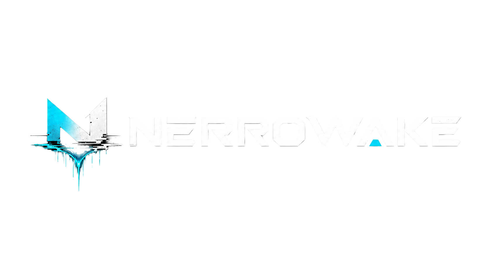

# Nerrowake Legal



> Your next life starts here.

Static legal site for **Nerrowake** — hosted on GitHub Pages. Provides the Privacy Policy and Terms of Service for Wakebot, the official Nerrowake Discord bot.

---

## Pages

| Page | File | Description |
|---|---|---|
| Legal index | `index.html` | Homepage with links to all legal documents |
| Privacy Policy | `privacy.html` | Data collection and usage policy for Wakebot |
| Terms of Service | `terms.html` | Rules and responsibilities for Wakebot users |

---

## Stack

- Plain HTML5 and CSS — no build step, no framework
- [Orbitron](https://fonts.google.com/specimen/Orbitron) (headings) + [Inter](https://fonts.google.com/specimen/Inter) (body) via Google Fonts
- Deployed via GitHub Pages

---

## Local Development

No build tools required. Open any file directly in a browser, or use a simple local server:

```bash
# Python
python -m http.server 8080

# Node (npx)
npx serve .
```

Then visit `http://localhost:8080`.

---

## Structure

```
nerrowake-legal/
├── assets/
│   └── images/
│       ├── nerrowake-logo.png   # Wordmark (header)
│       └── nerrowake-icon.png   # Icon mark (favicon)
├── index.html                   # Legal index / homepage
├── privacy.html                 # Privacy Policy
├── terms.html                   # Terms of Service
└── style.css                    # All styles — single stylesheet
```

---

## Brand

Nerrowake is a gaming and game-development brand focused on immersive worlds, community-driven games, devlogs, and playable experiences. Visual identity: dark atmospheric theme, Orbitron headings, cyan accent (`#00d4ff`), steel-blue palette.

---

## Contact

Questions or data requests: [nerrowake@gmail.com](mailto:nerrowake@gmail.com)
